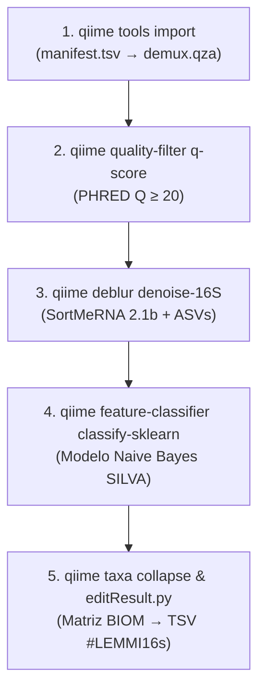

# 🔬 GUÍA 3: PIPELINE QIIME 2 (PC LOCAL Y CLÚSTER HPC)
## 🧬 Control de Calidad PHRED, Denoising con Deblur y Clasificación Bayesiana Supervisada

> **Proyecto:** Benchmark LEMMI16s en Arquitecturas Heterogéneas  
> 📄 **Documento:** `03_guia_pipeline_qiime2.md`  
> 📅 **Fecha:** Septiembre 2026  
> 🔬 **Pipeline:** QIIME 2 (Release 2023.2 / LEMMI 2022.8)  
> 📊 **Dataset Oficial:** `alfa_v1v2_SILVA` (5 muestras: `c001` a `e002`, 2,690,077 lecturas pareadas)

---


> [!IMPORTANT]
> **Optimización de Memoria RAM en el Clasificador Taxonómico:**
> La base de datos completa SILVA 138 sin acotar contiene más de 500,000 secuencias y requiere entre 32 y 64 GB de RAM durante la clasificación con `q2-feature-classifier classify-sklearn`, lo que causaría un colapso por *Out-of-Memory* (OOM). Para el benchmark oficial, se empleó el clasificador entrenado sobre **62,000 secuencias representativas de la región V1–V2** (`referenceClassificator.qza`, 118 MB). Esto redujo el consumo máximo de RAM a solo 2.1 GB en el clúster y 2.4 GB en la máquina nativa (con 2 hilos por tarea), permitiendo una ejecución 100% estable sin desbordamiento de memoria.

## 1. 🎯 Los 5 Pasos Científicos y Parches de Compilación

QIIME 2 ejecuta una cadena analítica estricta dividida en 5 fases secuenciales:



### 📋 Matriz de Pasos Científicos de QIIME 2

| Paso | Comando Principal | Entrada | Salida | Propósito Biológico |
| :---: | :--- | :--- | :--- | :--- |
| **1** | `qiime tools import` | `manifest.tsv` + FASTQs | `demux.qza` | Empaqueta lecturas pareadas en formato `.qza` |
| **2** | `quality-filter q-score` | `demux.qza` | `demux-filtered.qza` | Descarta lecturas con calidad PHRED < 20 |
| **3** | `deblur denoise-16S` | `demux-filtered.qza` | `rep-seqs.qza`, `table.qza` | Elimina quimeras con SortMeRNA (trim=120 pb) |
| **4** | `classify-sklearn` | `rep-seqs.qza` + modelo | `taxonomy.qza` | Inferencia supervisada Naive Bayes contra SILVA |
| **5** | `taxa collapse` | `table.qza` + `taxonomy.qza` | `results.tsv` (#LEMMI16s) | Agrupa a nivel 7 (Especie) y exporta tabla TSV |

### 🛠️ Parches Críticos de Compatibilidad y Compilación ARM64
* **SortMeRNA 2.1b:** Se utilizó la biblioteca traductora `sse2neon.h` para emular instrucciones vectoriales Intel SSE2 sobre núcleos ARM NEON, y se añadió el flag `-fsigned-char` para resolver un bucle infinito causado por la interpretación de tipos de caracteres sin signo en arquitecturas ARM.
* **Scikit-Learn 0.24.1:** Versión matemática obligatoria en Python 3.8. Versiones superiores (>= 1.0) provocan errores de deserialización al cargar el clasificador pre-entrenado `referenceClassificator.qza`.

---

## 2. 💻 Forma de Corrida en el PC Local (Laptop ASUS TUF x86_64)

### ⚙️ Entorno y Rutas Locales
* **Entorno Conda:** `/home/cristian-solano/proyectos/miniconda3/envs/qiime2_env`
* **Modelo SILVA:** `/home/cristian-solano/lemmi16s/benchmark/tmp/qiime2_alfa_v1v2_SILVA/tmp_alfa_v1v2_SILVA`
* **Muestra:** `/home/cristian-solano/lemmi16s/benchmark/instances/alfa_v1v2_SILVA/alfa_v1v2_SILVA-c001`

---

### 🔹 Opción A: Corrida Manual Completa en 1 Sola Ejecución (513,102 pares de lecturas)
Ejecuta las 5 fases paso a paso con el entorno nativo en la laptop (~814 segundos / 13.57 minutos a 4 hilos):

```bash
# 1. Cargar entorno nativo de QIIME 2
export PATH="/home/cristian-solano/proyectos/miniconda3/envs/qiime2_env/bin:$PATH"

SAMPLE_DIR="/home/cristian-solano/lemmi16s/benchmark/instances/alfa_v1v2_SILVA/alfa_v1v2_SILVA-c001"
MODEL_PATH="/home/cristian-solano/lemmi16s/benchmark/tmp/qiime2_alfa_v1v2_SILVA/tmp_alfa_v1v2_SILVA"
WORK_DIR="/tmp/run_qiime2_pc_manual"

mkdir -p "$WORK_DIR"
cd "$WORK_DIR"

# 2. Paso 1: Manifiesto e Importación
echo "sample-id,absolute-filepath,direction" > manifest.tsv
echo -e "Sample1,${SAMPLE_DIR}/queryReads1.fq,forward" >> manifest.tsv
echo -e "Sample1,${SAMPLE_DIR}/queryReads2.fq,reverse" >> manifest.tsv

qiime tools import \
  --type SampleData[PairedEndSequencesWithQuality] \
  --input-path manifest.tsv \
  --output-path demux.qza \
  --input-format PairedEndFastqManifestPhred33

# 3. Paso 2: Filtrado Estadístico por Calidad (Q >= 20)
qiime quality-filter q-score \
  --i-demux demux.qza \
  --p-min-quality 20 \
  --o-filtered-sequences demux-filtered.qza \
  --o-filter-stats demux-filter-stats.qza

# 4. Paso 3: Denoising y Corrección de Errores con Deblur (4 hilos, trim=120 pb)
qiime deblur denoise-16S \
  --i-demultiplexed-seqs demux-filtered.qza \
  --p-trim-length 120 \
  --p-jobs-to-start 4 \
  --o-representative-sequences rep-seqs.qza \
  --o-table table.qza \
  --p-sample-stats \
  --o-stats deblur-stats.qza

# 5. Paso 4: Clasificación Supervisada Naive Bayes contra SILVA
qiime feature-classifier classify-sklearn \
  --i-classifier "${MODEL_PATH}/referenceClassificator.qza" \
  --i-reads rep-seqs.qza \
  --p-n-jobs 4 \
  --o-classification taxonomy.qza

# 6. Paso 5: Colapso Taxonómico a nivel 7 (Especie) y Exportación BIOM
qiime taxa collapse \
  --i-table table.qza \
  --i-taxonomy taxonomy.qza \
  --p-level 7 \
  --o-collapsed-table phyla-table.qza

qiime tools export --input-path phyla-table.qza --output-path .
biom convert -i feature-table.biom -o results.txt --to-tsv

# 7. Estandarización final a formato LEMMI16s
python3 /home/cristian-solano/lemmi16s/resources/candidate_containers/qiime2_20228_lemmi16s/scripts/editResult.py \
  results.txt results.tsv summary_taxonomy.tsv

# 8. Guardar predicción final
cp results.tsv /home/cristian-solano/lemmi16s/benchmark/analysis_outputs/qiime2_20228_lemmi16s.alfa_v1v2_SILVA-c001.predictions.tsv
```

---

### 🔹 Opción B: Corrida Nativa Paralela en 5 Chunks (`run_5chunks_native.sh`)
Divide los 513k pares de lecturas en 5 chunks simultáneos acelerando radicalmente el tiempo de cómputo:

```bash
/home/cristian-solano/lemmi16s-cluster-backup/scripts_cluster_5nodos/run_5chunks_native.sh qiime2 alfa_v1v2_SILVA-c001
```

| Métrica en Laptop | Corrida en 1 Bloque | Corrida en 5 Chunks |
| :--- | :---: | :---: |
| **Tiempo de Ejecución** | **814.0 s (13.57 min)** | **195.0 s (3.25 min)** |
| **Aceleración (Speedup)** | Línea base 1.0x | **4.17x de aceleración** |
| **Salida Generada** | `qiime2_20228_lemmi16s.*.predictions.tsv` | `qiime2_lemmi16s.*.5chunks_merged.tsv` |
| **Concordancia Biológica** | **100.00% Idéntico (0 diffs)** | **100.00% Idéntico (0 diffs)** |

---

### 🔹 Medición de Telemetría Energética en PC (Intel RAPL)
Ejecución nativa automatizada mediante el script dedicado en `lemmi16s/workflow/scripts/nativo/run_qiime2_energy.sh`, orquestando las 5 etapas del pipeline (import, quality-filter, Deblur, classify-sklearn, taxa collapse L7) y protocolo unificado de telemetría (60 s estabilización + 300 s / 5 min reposo previo a 1.0 Hz y medición continua):

```bash
# 1. Permisos RAPL
sudo chmod 444 /sys/class/powercap/intel-rapl:0/energy_uj

# 2. Ejecución de 1 muestra (ejemplo: c001)
bash /home/cristian-solano/lemmi16s/workflow/scripts/nativo/run_qiime2_energy.sh c001

# 3. Ejecución del lote completo (c001, c002, c003, e001, e002)
bash /home/cristian-solano/lemmi16s/workflow/scripts/nativo/run_qiime2_energy.sh all
```

---

## 3. 🍓 Forma de Corrida en el Clúster Raspberry Pi 5 (Slurm / ARM64)

### ⚙️ Entorno y Rutas en el Clúster NFS
* **Entorno Específico:** `/shared/users/grupo1/qiime2_arm64/` (Python 3.8 con scikit-learn 0.24.1)
* **Binario SortMeRNA Parcheado:** `/shared/users/grupo1/build/sortmerna-2.1b`
* **Despachador Universal:** `/shared/users/grupo1/lemmi16s/workflow/scripts/run_tool_analysis.sh`
* **Script Tradicional Slurm:** `/shared/users/grupo1/sbatch_qiime2_single.sh`

---

### 🔹 Opción A: Corrida en 1 Solo Nodo (Slurm Tradicional)
Ejecuta la muestra completa en un nodo individual Raspberry Pi 5 a 4 hilos (~1717 segundos):

```bash
sbatch --job-name=q2_c001 /shared/users/grupo1/sbatch_qiime2_single.sh c001
```

---

### 🔹 Opción B: Corrida Distribuida en los 5 Nodos Físicos (Job Array Slurm)
Distribuye los 513,102 pares de lecturas entre los 5 nodos físicos (`rbp5-1` al `rbp5-5`), reduciendo el tiempo de reloj a **~380 segundos** (~4.5x speedup):

```bash
sbatch /shared/users/grupo1/scripts_cluster_5nodos/sbatch_5nodos_pipeline.sh qiime2 alfa_v1v2_SILVA-c001
```

#### ¿Por qué la Fusión en 5 Chunks es 100% Determinista en QIIME 2?
El clasificador Naive Bayes evalúa secuencias representativas (ASVs) individualmente. Las probabilidades condicionales no dependen del número total de secuencias en el lote. Al unir las 5 tablas con `merge_predictions_5.py`, la suma exacta de frecuencias genera una tabla idéntica a la corrida en bloque.

---

## 4. 🔍 Verificación de Salidas y Validación

El archivo final debe exhibir la estructura oficial:

```tsv
#LEMMI16s
Group_ID	Size	Taxonomy
d__Bacteria;p__Firmicutes;c__Bacilli;o__Lactobacillales;f__Streptococcaceae;g__Streptococcus;s__Streptococcus_mitis	112450	d__Bacteria;p__Firmicutes;c__Bacilli;o__Lactobacillales;f__Streptococcaceae;g__Streptococcus;s__Streptococcus_mitis
```

Para verificar identidad biológica entre el clúster y la laptop:
```bash
diff -u \
  /home/cristian-solano/lemmi16s/benchmark/analysis_outputs/qiime2_20228_lemmi16s.alfa_v1v2_SILVA-c001.predictions.tsv \
  /shared/users/grupo1/lemmi16s/benchmark/analysis_outputs/qiime2_arm64.alfa_v1v2_SILVA-c001.predictions.tsv
```
*(Debe retornar 0 diferencias).*

> [!IMPORTANT]
> **Compatibilidad de Modelos:** Mantener `scikit-learn 0.24.1` tanto en la laptop como en el clúster garantiza que no existan discrepancias numéricas en la asignación Bayesiana de taxones.
